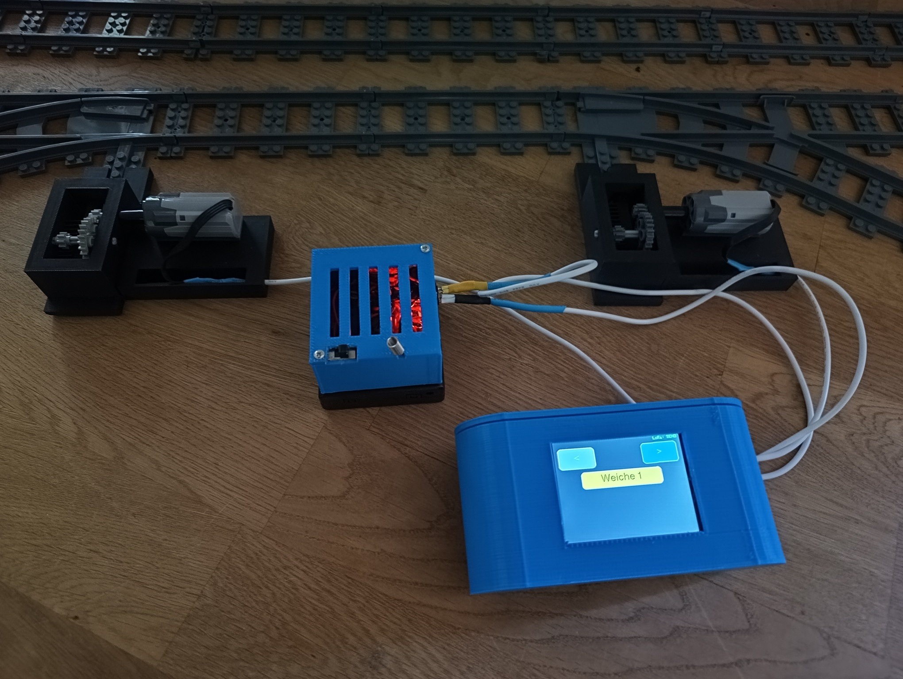

# LEGO-Eisenbahnsteuerung mit ESP32 und LoRa

Drahtlose Steuerung einer LEGO-Eisenbahn mit ESP32, LoRa, TFT-Touchdisplay, Motortreiber und Sound.

## Projektübersicht

                         LEGO-EISENBAHN
                               │
              ┌────────────────┴────────────────┐
              │                                 │
              ▼                                 ▼
       LOKSTEUERUNG                       WEICHENSTEUERUNG
              │                                 │
        TFT Touchdisplay                  TFT Touchdisplay
              │                                 │
              ▼                                 ▼
        LoRa Sender                        LoRa Sender
              │                                 │
              │ 868,1 MHz                     │ 868,3 MHz
              ▼                                 ▼
        LoRa Empfänger                    LoRa Empfänger
              │                                 │
        ┌─────┴─────┐                         │
        │           │                         │
      DRV8833   DFPlayer                    DRV8833
        │           │                         │
        ▼           ▼                         ▼
    LEGO-Motor    Sound                   Weichenmotor

Das Projekt besteht aus zwei getrennten Steuerungsbereichen:

- Loksteuerung
- Weichensteuerung

Die Bedienung erfolgt über TFT-Touchdisplays. Die Steuerbefehle werden drahtlos über LoRa an die jeweiligen Empfänger übertragen.

1. Loksteuerung

Die Lok wird über ein TFT-Touchdisplay gesteuert.

Funktionen
Vorwärts
Stop
Rückwärts
Geschwindigkeit 0–100 %
Auswahl der Lok-ID
Soundsteuerung
LoRa-Übertragung
automatische zyklische Übertragung
Failsafe beim Empfänger

Richtungen

0 = STOP
1 = VORWÄRTS
2 = RÜCKWÄRTS

Geschwindigkeit

Die Geschwindigkeit wird auf dem Touchdisplay von 0–100 %

eingestellt.

Für die Übertragung wird dieser Wert auf den PWM-Bereich 0–255

umgerechnet.

2. Soundsteuerung

Die Loksteuerung besitzt vier Soundmodi:

0 = SOUND_OFF
1 = SOUND_STAND
2 = SOUND_DRIVE
3 = SOUND_SIGNAL

Der Empfänger verwendet einen DFPlayer Mini zur Wiedergabe der Sounds.

Die Dateien liegen im Ordner:

/01/

mit:

001.mp3 = Fahrt
002.mp3 = Stand
003.mp3 = Signal

3. Lok-ID

Über die Touchoberfläche kann die aktive Lok ausgewählt werden.

Die Lok-ID wird zusammen mit den Steuerdaten über LoRa übertragen.

Im Empfänger wird festgelegt, auf welche Lok-ID der Empfänger reagiert.

Beispiel:
#define MY_LOK_ID 1
Damit können mehrere Lokempfänger mit unterschiedlichen IDs betrieben werden.

4. LoRa-Daten der Loksteuerung

Der Lok-Sender überträgt vier Bytes:

Byte 1   Lok-ID
Byte 2   Richtung
Byte 3   Geschwindigkeit
Byte 4   Sound-Modus

Beispiel:

Lok 1
Richtung vorwärts
Geschwindigkeit 50 %
Sound Fahrt

wird als entsprechende Bytefolge übertragen.

Die Geschwindigkeit wird vor der Übertragung von 0–100 % auf 0–255 umgesetzt.

5. Lok-Empfänger

Der Lok-Empfänger verarbeitet die LoRa-Steuerdaten und steuert damit den LEGO-Motor.

Verwendet werden:

ESP32
LoRa-Modul
DRV8833 Motortreiber
DFPlayer Mini
Motortreiber

Der DRV8833 wird für die Richtungs- und Geschwindigkeitssteuerung verwendet.

Die Geschwindigkeit wird über PWM gesteuert.

PWM-Frequenz: 20 kHz
Auflösung:    8 Bit

6. Failsafe

Der Lok-Empfänger besitzt eine Sicherheitsfunktion.

Wenn länger als

800 ms

kein gültiges Steuerpaket empfangen wird, wird:

der Motor gestoppt
der Motortreiber deaktiviert
der Sound ausgeschaltet

Damit wird verhindert, dass eine Lok bei einem Ausfall der Funkverbindung unkontrolliert weiterfährt.

7. Weichensteuerung

Die Weichen werden ebenfalls über ein TFT-Touchdisplay gesteuert.

Über das Display kann zwischen zwei Weichen umgeschaltet werden:

Weiche 1
Weiche 2

Für die ausgewählte Weiche kann anschließend gewählt werden:

Gerade
Abzweig

8. Weichensteuerung über LoRa

Die Weichensteuerung verwendet eine eigene LoRa-Frequenz:

868,3 MHz

Der Sender überträgt:

Byte 1   Weichen-ID
Byte 2   Schaltbefehl

Die Befehle sind:

1 = Gerade
2 = Abzweig

9. Weichen-Empfänger

Der Weichen-Empfänger steuert den Weichenmotor über einen DRV8833.

Zum Schalten wird ein kurzer Motorimpuls verwendet.

PWM:          80
Impulsdauer:  400 ms

Nach dem Impuls wird der Motor wieder abgeschaltet.

Dadurch wird der Weichenantrieb nicht dauerhaft bestromt.

10. Speicherung des Weichenzustands

Der zuletzt bekannte Zustand der Weiche wird im EEPROM des ESP32 gespeichert.

Damit bleibt der Zustand auch nach einem Neustart erhalten.

Gespeichert wird:

1 = GERADE
2 = ABZWEIG

Beim Einschalten wird der gespeicherte Zustand aus dem EEPROM gelesen.

Ist kein gültiger Zustand gespeichert, wird als Standard verwendet:

GERADE

11. Hardware
Lok-Sender:
ESP32
TFT-Touchdisplay
LoRa-Modul
Lok-Empfänger:
ESP32
LoRa-Modul
DRV8833
LEGO-Motor
DFPlayer Mini
Lautsprecher
Weichen-Sender:
ESP32
TFT-Touchdisplay
LoRa-Modul
Weichen-Empfänger:
ESP32
LoRa-Modul
DRV8833
Weichenmotor
EEPROM des ESP32

12. LoRa-Anschluss

Für die LoRa-Module werden folgende SPI-Pins verwendet:

ESP32	Funktion
GPIO 18	SCK
GPIO 19	MISO
GPIO 23	MOSI
GPIO 5	SS / CS
GPIO 17	RESET
GPIO 26	DIO0

13. Motorsteuerung

Die Motorsteuerung der Lok verwendet:

ESP32	Funktion
GPIO 25	IN1
GPIO 33	IN2
GPIO 32	ENA
GPIO 27	STBY

Der DRV8833 ermöglicht:

Vorwärtsfahrt
Rückwärtsfahrt
Stop
Geschwindigkeitsregelung über PWM

14. DFPlayer Mini

Der DFPlayer Mini wird über eine serielle Schnittstelle angeschlossen.

GPIO 16 = RX
GPIO 4  = TX

Der Player wird mit

9600 Baud

betrieben.

Die Sounddateien werden über Ordner und Dateinummer angesprochen.

15. TFT-Touchdisplay

Die Steuerung verwendet ein TFT-Touchdisplay mit der Bibliothek:

TFT_eSPI

Die Touchkalibrierung wird im jeweiligen Sender-Sketch gespeichert.

Das Display stellt die wichtigsten Funktionen direkt als Touchflächen bereit.

16. Verwendete Software und Bibliotheken
Lok-Sender:
TFT_eSPI
SPI
LoRa
Lok-Empfänger:
SPI
LoRa
DFRobotDFPlayerMini
Weichen-Sender:
TFT_eSPI
SPI
LoRa
Weichen-Empfänger:
SPI
LoRa
EEPROM

17. Dateien im Repository
Loksteuerung/
├── _LoRaLock_Sender.ino
└── _LoRaLock_Empfänger.ino

Weichensteuerung/
├── _LoRaWeiche_Sender.ino
└── _LoRaWeiche_Empfänger.ino

18. Aufbau

Das Projekt ist modular aufgebaut.

Die Bedienung und die eigentliche Steuerung sind voneinander getrennt:

Touchscreen
    │
    ▼
LoRa-Sender
    │
    │ Funk
    ▼
LoRa-Empfänger
    │
    ▼
Motortreiber
    │
    ▼
Motor

Dadurch können Steuerung und Fahrzeuge räumlich voneinander getrennt betrieben werden.

19. Mehrere Loks

Durch die Verwendung einer Lok-ID kann ein Empfänger gezielt auf seine eigene Lok-ID reagieren.

Beispiel:

Lok 1 → MY_LOK_ID 1
Lok 2 → MY_LOK_ID 2
Lok 3 → MY_LOK_ID 3

Der Sender kann die gewünschte Lok über die Touchoberfläche auswählen.

Das Konzept ermöglicht damit eine spätere Erweiterung auf mehrere Loks.

20. Mehrere Weichen

Auch die Weichen werden über eine ID angesprochen:

Weiche 1
Weiche 2

Das gleiche Prinzip kann später auf weitere Weichen erweitert werden.

21. Sicherheit

Die Loksteuerung verwendet einen Kommunikations-Timeout.

Wird keine gültige Steuerung mehr empfangen, wird die Lok automatisch gestoppt.

Bei der Weichensteuerung wird der Motor nur für die definierte Impulsdauer aktiviert.

22. Projektstatus

Das Projekt befindet sich in aktiver Weiterentwicklung.

Die hier veröffentlichten Sketches entsprechen dem aktuell funktionierenden Entwicklungsstand.

Autor

Joachim Reuter

Dieses Projekt entstand als privates Elektronik- und Modellbahnprojekt mit ESP32 und LoRa.

